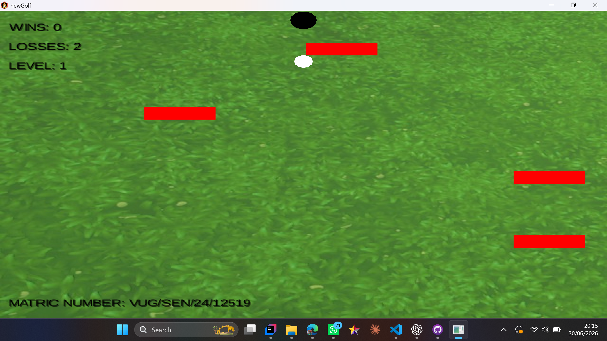
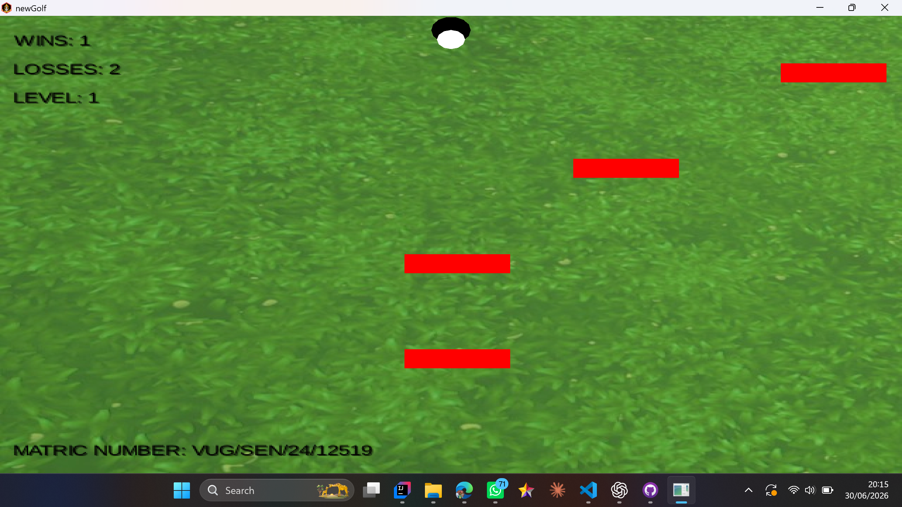

# 2D MiniGolf Game

A physics-based 2D MiniGolf game developed using Java and LibGDX. The project simulates realistic ball movement, shot power, and hole detection mechanics while applying object-oriented programming principles and game-loop architecture.

## Features

* Physics-based golf ball movement
* Directional aiming system
* Hole detection and win condition
* Collision handling
* Object-oriented game architecture

## Technologies Used

* Java
* LibGDX
* Object-Oriented Programming (OOP)

## Screenshots

### Gameplay

### Winning Screen

## Project Purpose

This project was developed to strengthen my understanding of Java programming, game development concepts, object-oriented design, and the LibGDX framework. It also provided practical experience implementing game physics and event-driven interactions.

## How to Run

1. Clone the repository.
2. Open the project in IntelliJ IDEA or another Java IDE.
3. Import the Gradle project.
4. Run the DesktopLauncher class.

## Author

Ifesanmi Oluwagbotemi Gabriel

Software Engineering Student | Full-Stack Developer | Game Developer
